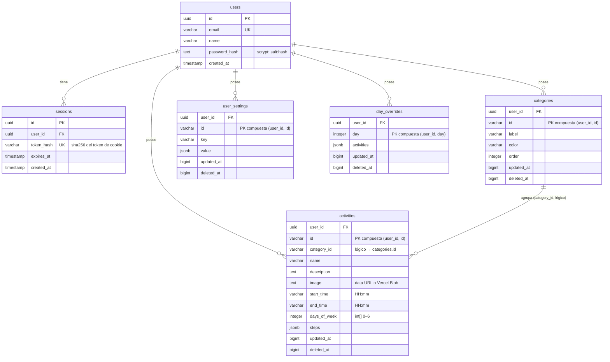

# Astro Starter Kit: Minimal

```sh
bun create astro@latest -- --template minimal
```

> 🧑‍🚀 **Seasoned astronaut?** Delete this file. Have fun!

## 🚀 Project Structure

Inside of your Astro project, you'll see the following folders and files:

```text
/
├── public/
├── src/
│   └── pages/
│       └── index.astro
└── package.json
```

Astro looks for `.astro` or `.md` files in the `src/pages/` directory. Each page is exposed as a route based on its file name.

There's nothing special about `src/components/`, but that's where we like to put any Astro/React/Vue/Svelte/Preact components.

Any static assets, like images, can be placed in the `public/` directory.

## 🚀 Stack Tecnológico Confirmado
Este proyecto utiliza tecnologías de vanguardia para garantizar el máximo rendimiento:
- **Astro 6.x** (Configurado como SPA)
- **Vite 8.x** (Con **Rolldown** y **LightningCSS** para builds ultra-rápidos en Rust)
- **Svelte 5.x** (Sistema de Runes: `$state`, `$derived`, `$props`)
- **Bun** (Runtime y gestor de paquetes de alto rendimiento)
- **Dexie.js 4.x** (Capa sobre IndexedDB para persistencia local)

## 💡 Notas de Desarrollo
Para que el build de producción funcione correctamente:
- **SSR Bypass**: Los componentes que interactúan con IndexedDB (como `Dashboard` e `InitDB`) deben invocarse con `client:only="svelte"` en las páginas de Astro. Esto evita que Node.js intente ejecutar código de navegador durante la fase de prerenderización.
- **Optimizaciones**: Se ha forzado el uso de **Rolldown** (sustituto experimental de esbuild/rollup escrito en Rust) y **LightningCSS** para la minificación, aprovechando las capacidades de Vite 8.

## 🧞 Comandos
Todos los comandos se ejecutan desde la raíz del proyecto:
- `bun dev`: Inicia el servidor de desarrollo en `localhost:4321`.
- `bun run build`: Genera el sitio de producción en la carpeta `dist/`.
- `bun run preview`: Previsualiza el build de producción localmente.

---
*Diseñado para una experiencia de usuario fluida y un desarrollo de alto rendimiento.*

## 🗄️ Esquema relacional de la base de datos (Neon Postgres)

<arg_value><b88a6f17>El backend de sincronización usa **PostgreSQL (Neon)** con **Drizzle ORM** — definido en `src/server/schema.ts`. Todas las tablas de datos del planificador se replican **por usuario** y siguen el mismo patrón de sync:

- **`updated_at`** (ms epoch) → resolución de conflictos *Last-Writer-Wins* entre dispositivos.
- **`deleted_at`** (tombstone) → los borrados se propagan como marcas blandas; las filas nunca se eliminan físicamente (excepto al borrar el usuario, que hace `CASCADE`).



### Detalles por tabla

| Tabla | Clave primaria / única | Propósito |
|---|---|---|
| `users` | `id` (uuid, PK) · `email` (unique) | Cuentas con contraseña (scrypt). |
| `sessions` | `id` (uuid, PK) · `token_hash` (unique) | Sesiones de 30 días; el token plano vive solo en la cookie httpOnly, en BD se guarda su hash SHA-256. Borrado en cascada con el usuario. |
| `categories` | `(user_id, id)` unique | Categorías del planificador con color y orden. |
| `activities` | `(user_id, id)` unique | Actividades de la plantilla semanal: horario `HH:mm`, días de la semana (`int[]`), pasos (`jsonb`) e imagen (data URL offline o URL de Vercel Blob). `category_id` es una relación **lógica** (la integridad se mantiene a nivel de aplicación, el sync reasigna huérfanas). |
| `user_settings` | `(user_id, id)` unique | Ajustes por usuario (`key`/`value` jsonb, p. ej. `startHour`/`endHour`). |
| `day_overrides` | `(user_id, day)` unique | Ediciones temporales de un día concreto (⚡) que reemplazan la plantilla semanal. |

### Espejo local (offline-first)

La app funciona **local-first**: Dexie/IndexedDB (schema v4) replica estas mismas entidades en el navegador (`activities`, `categories`, `settings`, `dayOverrides`) con los mismos campos `updatedAt`/`deletedAt`, y el motor de sync (`src/lib/sync.ts`) empuja/jala cambios incrementales contra `POST /api/sync`. Sin sesión activa, todo funciona 100% offline.

### 💾 Importación y exportación JSON

**Exportar** (Ajustes → Respaldos): descarga `planificador-datos-YYYY-MM-DD.json` con actividades, categorías, ajustes y ediciones temporales vivas. Los registros eliminados (tombstones) **no se incluyen** — el export es para migrar/respaldar datos, no para replicar borrados que el sync ya propagó.

**Importar**: el archivo pasa por un validador puro (`src/lib/importValidation.ts`) **antes** de tocar la base de datos:

- Chequeo de `app`, `version` (soporta v2 legacy con IDs numéricos → UUID) y presencia de datos.
- Whitelist de campos por registro: nombres truncados (255), descripciones (2000), horas `HH:MM` válidas con fin > inicio, días 0–6 deduplicados, imágenes solo `data:image/` o `https://`, colores hex, pasos con título.
- Actividades con categoría inexistente → reasignadas a "Rutina" (con advertencia).
- Ediciones temporales vacías o totalmente inválidas → ignoradas (no generan filas fantasma que el sync replicaría).
- Todo problema se reporta como advertencia con el detalle; nada se descarta en silencio.

Antes de reemplazar los datos se muestra un **resumen + advertencias** con confirmación explícita. Con sesión activa, tras importar se fuerza un **sync completo** para subir los registros importados a la nube (sus `updatedAt` suelen ser antiguos y no entrarían en el push incremental). Límite de tamaño: 10 MB.
